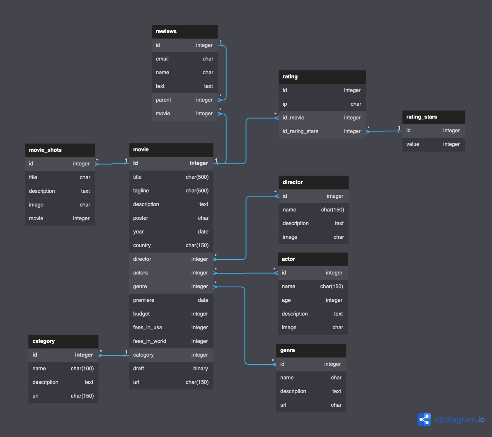

<h1 align="center">
  <br>
  <a href="https://www.youtube.com/playlist?list=PLF-NY6ldwAWrb6nQcPL21XX_-AmivFAYq">
    
  </a>
  <br>
  CinemaLib
  <br>
</h1>

<h4 align="center">
    Cinema library website
    <br>
    by
    <br>
    <a href="https://www.youtube.com/playlist?list=PLF-NY6ldwAWrb6nQcPL21XX_-AmivFAYq" target="_blank">
      Django School | Lessons Django 3 (Ru)
    </a>
</h4>

<div align="center">

[](https://conventionalcommits.org)

</div>
<hr>

<p align="center">
  <a href="#features">Features</a> •
  <a href="#tech-stack">Tech stack</a> •
  <a href="#how-to-use">How To Use</a> •
  <a href="#additional-material">Additional material</a> •
  <a href="#">Website</a>
</p>


## Features
* lorem


## Tech stack
- [Django 3](https://www.djangoproject.com/)


## How To Use
To clone and run this project, you'll need:
- [Git](https://git-scm.com)
- [Python](https://www.python.org/downloads/)
- [Poetry](https://python-poetry.org/docs/#installation)


<details>
<summary>Step-by-step commands</summary>

1. Firstly clone repo
   ```bash
   git clone git@github.com:mrKazzila/cinema_library_website.git
   ```

2. Settings Poetry
   ```bash
   poetry config virtualenvs.in-project true
   ```

3. Activate venv
   ```bash
   poetry shell
   ```

4. Install packages
   ```bash
   poetry install
   ```

5. Run project dependencies, migrations, fill the database with the fixture data etc
   ```bash
   python manage.py migrate
   python manage.py loaddata <path_to_fixture_files>
   python manage.py runserver
   ```

</details>


## Additional material
<details>
<summary>Database schema</summary>
<a href="https://dbdiagram.io/d/645233b2dca9fb07c46ce5fe">
    
</a>
</details>

<br>
<br>
<p align="center">
  <a href="https://github.com/mrKazzila">GitHub</a> •
  <a href="https://mrkazzila.github.io/resume/">Resume</a> •
  <a href="https://www.linkedin.com/in/i-kazakov/">LinkedIn</a>
</p>
